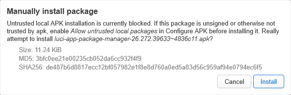
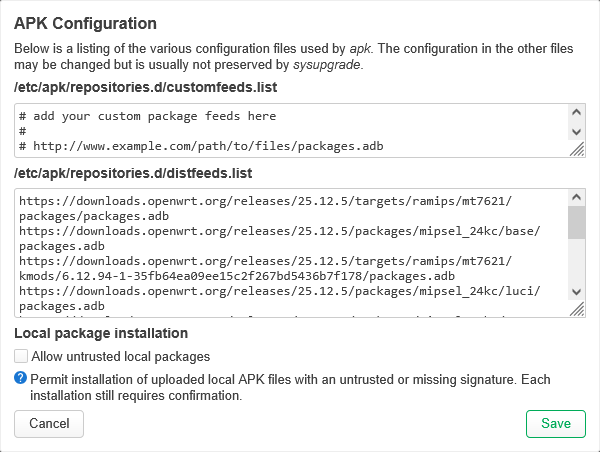
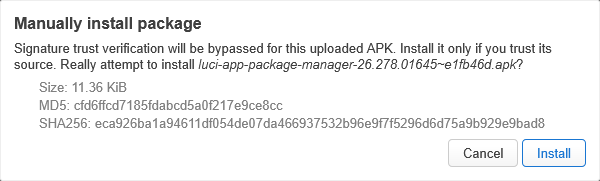

# LuCI Package Manager — Untrusted Local APK Support

An unofficial, security-sensitive patch for OpenWrt's stock
`luci-app-package-manager`. It adds an opt-in setting for installing uploaded
local APK packages that are not trusted by `apk`.

This is not a separate LuCI application and does not patch system files from a
package maintainer script. The released APK is a rebuilt
`luci-app-package-manager` from the OpenWrt LuCI source tree.

> **Target platform:** OpenWrt 25.12 with the APK package manager.

## Release scope

| Item | Value |
| --- | --- |
| OpenWrt release line | 25.12 |
| Upstream base | [`067535eaf51a59582b775a8b588a9b05810f8030`](https://github.com/openwrt/luci/commit/067535eaf51a59582b775a8b588a9b05810f8030) |
| Patched source | [`4836c113cdbd8c01b4586970d9471541084aaaec`](https://github.com/RzandAl/luci/commit/4836c113cdbd8c01b4586970d9471541084aaaec) |
| Release tag | `openwrt-25.12-067535e-r1` |
| APK package version | `26.272.39633~4836c11` |
| Release APK asset | `luci-app-package-manager-openwrt-25.12-067535e-r1.apk` |
| Package architecture | `noarch` |

## What the patch changes

- Adds **Allow untrusted local packages** to **Configure APK**.
- Stores the setting as
  `luci.package_manager.allow_untrusted_uploads` in UCI.
- Keeps the setting disabled by default.
- Shows the current **Blocked** or **Allowed** state on the Software page.
- Keeps the existing confirmation dialog for every uploaded package.
- Adds `--allow-untrusted` and `--force-non-repository` in the backend only
  when all of the following are true:
  - the package manager is `apk`;
  - the requested action is `install`;
  - exactly one package argument was supplied;
  - that argument is exactly `/tmp/upload.apk`;
  - the UCI setting is enabled.
- Prevents package names and paths from being interpreted as `apk` options by
  inserting the `--` option delimiter.
- Does not allow the frontend to supply arbitrary trust flags.

## Compatibility

| Area | Target or verified environment |
| --- | --- |
| Target | OpenWrt 25.12 with APK |
| Build | Official OpenWrt 25.12.5 SDK for `ramips/mt7621` |
| Runtime — Xiaomi Mi Router 3G | OpenWrt 25.12.2 and 25.12.5 (`ramips/mt7621`) |
| Runtime — Cudy WR3000S v1 | OpenWrt 25.12.5 (`mediatek/filogic`) |
| Validation | Blocked by default; explicit opt-in and per-upload confirmation required |

The released APK is architecture-independent (`noarch`). Compatibility outside
the OpenWrt 25.12 release line is not claimed.

## Screenshots

### Blocked by default

The Software page shows that untrusted local APK installation is blocked.

With the setting blocked, the upload confirmation explains that unsigned or
otherwise untrusted APKs require explicit opt-in.

### Explicit opt-in

The setting is available under **System → Software → Configure APK** and remains
disabled by default.

### Allowed after opt-in

After the setting is saved, the Software page shows the enabled state with a
yellow warning badge.

Each uploaded APK still requires a separate confirmation.

## Security model

Enabling this option bypasses APK signature trust only for the uploaded local
file and does not silently approve installation. Verify the file's origin and
checksum before enabling the option or confirming an upload.

The backend scope and operations that remain unaffected are documented in
[Security model](docs/SECURITY.md).

## Release packages

Assets for
[`openwrt-25.12-067535e-r1`](https://github.com/RzandAl/luci-app-package-manager-untrusted-apk/releases/tag/openwrt-25.12-067535e-r1):

- [`luci-app-package-manager-openwrt-25.12-067535e-r1.apk`](https://github.com/RzandAl/luci-app-package-manager-untrusted-apk/releases/download/openwrt-25.12-067535e-r1/luci-app-package-manager-openwrt-25.12-067535e-r1.apk)
- [`luci-app-package-manager-untrusted-upload-067535e.patch`](https://github.com/RzandAl/luci-app-package-manager-untrusted-apk/releases/download/openwrt-25.12-067535e-r1/luci-app-package-manager-untrusted-upload-067535e.patch)
- [`SHA256SUMS`](https://github.com/RzandAl/luci-app-package-manager-untrusted-apk/releases/download/openwrt-25.12-067535e-r1/SHA256SUMS)

The APK is intentionally untrusted. Verify `SHA256SUMS` and perform the first
installation from a terminal; see [Installation and rollback](docs/INSTALLATION.md)
for the complete procedure.

## Documentation

- [Installation, configuration, verification, and rollback](docs/INSTALLATION.md)
- [Security model](docs/SECURITY.md)
- [Release validation](docs/VALIDATION.md)
- [Build and release verification](BUILDING.md)
- [Automated patch validation](.github/workflows/validate.yml)

## Tests and validation

The `r1` release validation covered exact source and patch provenance, clean
standalone patch application, APK metadata and payload inspection, release
checksums, and runtime behavior on the devices listed in
[Compatibility](#compatibility).

The complete recorded scope is in [Release validation](docs/VALIDATION.md),
with reproduction commands in [BUILDING.md](BUILDING.md). The repository CI
also repeats clean patch application and syntax validation on every change.

## Source provenance

- Development branch:
  [`fix/package-manager-untrusted-upload-067535e`](https://github.com/RzandAl/luci/tree/fix/package-manager-untrusted-upload-067535e)
- Exact signed commit:
  [`4836c113cdbd8c01b4586970d9471541084aaaec`](https://github.com/RzandAl/luci/commit/4836c113cdbd8c01b4586970d9471541084aaaec)
- Standalone source patch:
  [`patches/luci-app-package-manager-untrusted-upload-067535e.patch`](patches/luci-app-package-manager-untrusted-upload-067535e.patch)
- Related upstream report:
  [`openwrt/luci#8482`](https://github.com/openwrt/luci/issues/8482)

## Upstream status

The long-term goal is to submit the change to OpenWrt LuCI. Once equivalent
support is available in the official OpenWrt package, this unofficial build
will be marked obsolete and users should return to the repository package.

## Maintainers

Developed and tested together by [AmleyID](https://github.com/AmleyID) and
[RazisID12](https://github.com/RazisID12).

## License

The patch and accompanying documentation are distributed under the
[Apache License 2.0](LICENSE), matching OpenWrt LuCI.
